<p align="center">
  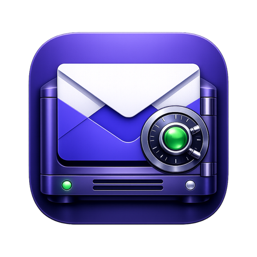
</p>

<h1 align="center">MailVault</h1>

<p align="center">
  <b>Read your mail. Keep your mail.</b><br>
  A local-first email client that files every message on your own disk as a plain <code>.eml</code>, and keeps it after the server lets go.
</p>

<p align="center">
  <a href="https://github.com/GraphicMeat/mail-vault-app/releases/latest"><b>Download</b></a> ·
  <a href="https://mailvaultapp.com/demo/"><b>Try it in your browser</b></a> ·
  <a href="https://mailvaultapp.com">Website</a> ·
  <a href="https://github.com/GraphicMeat/mail-vault-app/issues">Report an issue</a>
</p>

<p align="center">
  <a href="https://github.com/GraphicMeat/mail-vault-app/releases/latest"></a>
  <a href="https://github.com/GraphicMeat/mail-vault-app/releases"></a>
  <a href="https://github.com/GraphicMeat/mail-vault-app/stargazers"></a>
  
  
</p>

---

<picture>
  <source media="(prefers-color-scheme: dark)" srcset="website/screenshots/email-list-view-1440.webp">
  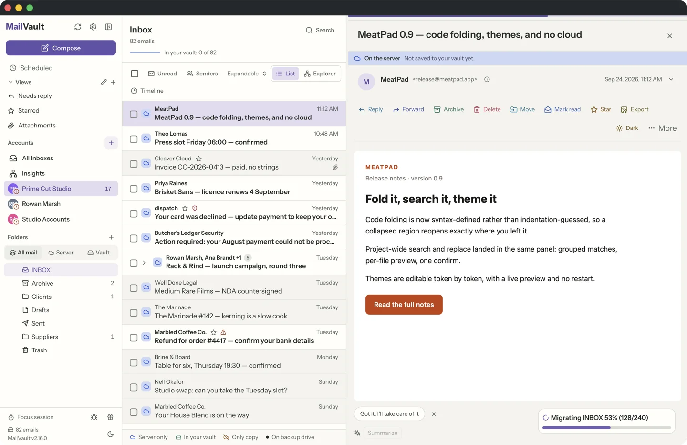
</picture>

MailVault is a full email client with a vault behind it. You read, search, thread and reply the way you would in any client, and every message you keep is written to your own disk as a standard `.eml` file in a Maildir tree, readable by anything. When the provider deletes it, expires it, or asks you to pay for storage, your copy does not care.

## Why MailVault?

- **Your mail outlives the server.** Every message you keep is a plain `.eml` on your own disk, and it stays there after the provider deletes it.
- **You can see what is safe.** Each row shows whether a message is on the server, in the vault, in both, or only on your disk.
- **Clear the server without losing anything.** Archive and delete in one step, or thousands at once by year, with crash-safe recovery.
- **Find anything, offline.** SQLite FTS5 search over the whole vault: 50,000 messages searched in under 15 ms in our test.
- **No lock-in.** Maildir and MBOX, readable by Thunderbird, Apple Mail or `grep`.
- **Private by default.** No account to create, no sync service in the middle, no telemetry. Credentials stay in your OS keychain, and AI can run on your own machine.
- **One-click sign-in.** Gmail, Microsoft 365 and Outlook.com through OAuth, plus any IMAP server.
- **Signed and self-updating.** Notarised on macOS, signed on Windows, on the Snap Store for Linux, and the core stays free.

## Platforms

| | |
|---|---|
| **macOS** | macOS 11 or later, Apple Silicon and Intel. Signed, notarised `.dmg` that updates itself through Sparkle. |
| **Windows** | Windows 10 or 11, 64-bit Intel or AMD. Signed installer (`-setup.exe`). |
| **Linux** | x86_64 and aarch64: `.deb` for Ubuntu 22.04+ / Debian 12+, or the Snap Store. Wayland and X11. |

Every build is on the [latest release](https://github.com/GraphicMeat/mail-vault-app/releases/latest). Accounts: any IMAP server, plus Gmail and Microsoft 365 through OAuth2 and Outlook.com through Microsoft Graph.

## Features

### Mail, properly

- **One-click sign-in** - Google and Microsoft 365 OAuth2, plus Microsoft Graph for Outlook.com. Everything else is plain IMAP, with server auto-detection from SRV records, Mozilla autoconfig and MX fallback.
- **Threaded conversations** - JWZ threading, quote folding, signature folding, oldest- or newest-first.
- **Compose that behaves** - templates, contacts picker, attachments, undo send from 15 seconds to 5 minutes, and an outbox that stages locally so a failed send is recoverable rather than lost.
- **Offline full-text search** - SQLite FTS5 over every message on your disk. A trigram index matches any part of a word and ignores accents, and a second index covers Chinese, Japanese and Korean. Filter by sender, date range, attachments or folder, with history and suggestions.

### Explorer and Insights

<p>
<picture>
  <source media="(prefers-color-scheme: dark)" srcset="website/screenshots/explorer-date-1440.webp">
  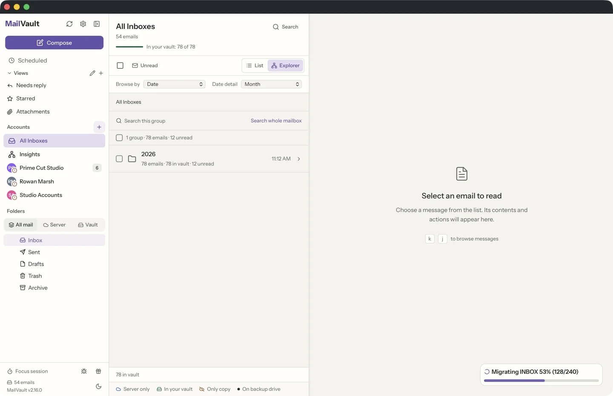
</picture>
<picture>
  <source media="(prefers-color-scheme: dark)" srcset="website/screenshots/insights-map-1440.webp">
  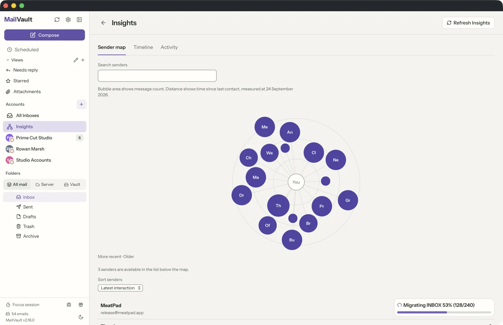
</picture>
</p>

- **Explorer** - switch from List to browse by Date, Sender, or Date → Conversation. Open year, month and optional day groups, follow breadcrumbs, search the current group, or select its messages together. Your view and place are remembered.
- **Insights** - a sender map, sender timeline, and daily activity calendar built from local headers. Frequent contacts have larger bubbles; recent contacts sit closer to you. Filter by account, date, direction, or likely automated mail, then open matching messages.

### The vault

<picture>
  <source media="(prefers-color-scheme: dark)" srcset="website/screenshots/state-icons-1440.webp">
  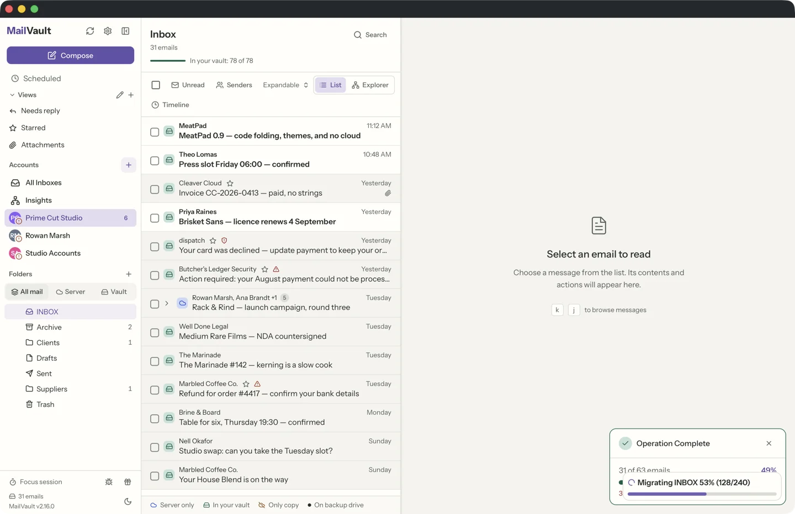
</picture>

- **Maildir + `.eml`** - one standard RFC 5322 file per message: headers, body, inline images, attachments. Readable by Thunderbird, Apple Mail, `grep`, or anything else you own.
- **Per-message state, on the row** - whether a message is on the server, in the vault, in both, or local-only because the server no longer has it.
- **Delete from the server with confidence** - archive first, then delete, in one operation. The local copy stays.
- **Portable by construction** - the mail is plain files: back the folder up, move it to another machine, mirror it to an external drive, or export the lot as MBOX for Thunderbird or Apple Mail. No lock-in.

### Threads, or chat

<picture>
  <source media="(prefers-color-scheme: dark)" srcset="website/screenshots/chat-view-thread-1440.webp">
  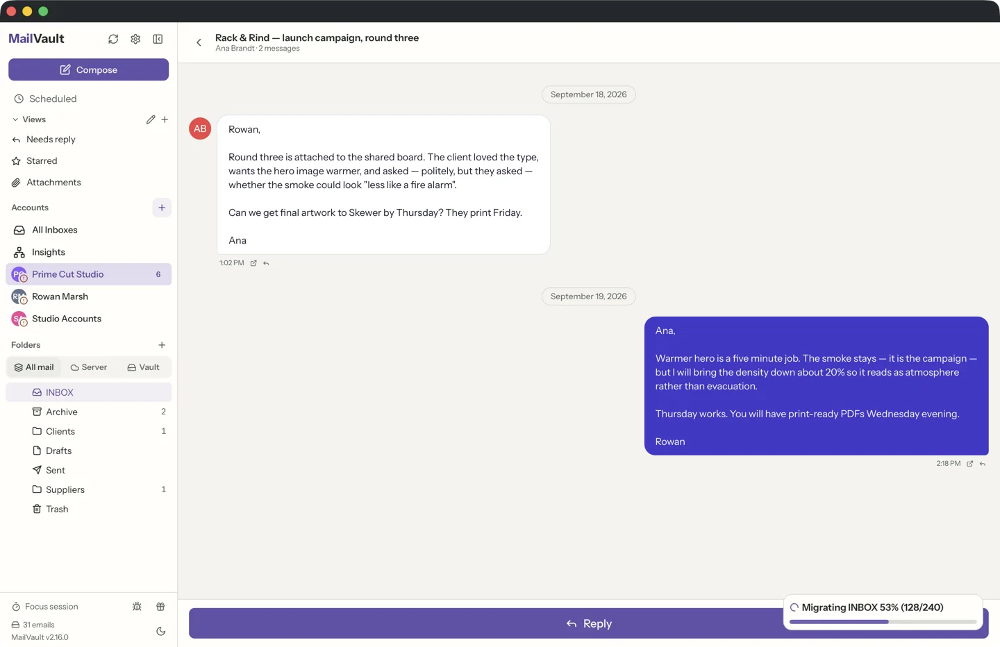
</picture>

Conversations stack chronologically with quotes folded, or switch the whole client to chat view: sent and received mail merged into one continuous thread of bubbles, per-sender avatars, progressive body loading. Same mailbox, two ways to read it.

### Organise it your way

<p>
<picture>
  <source media="(prefers-color-scheme: dark)" srcset="website/screenshots/settings-auto-tags-1440.webp">
  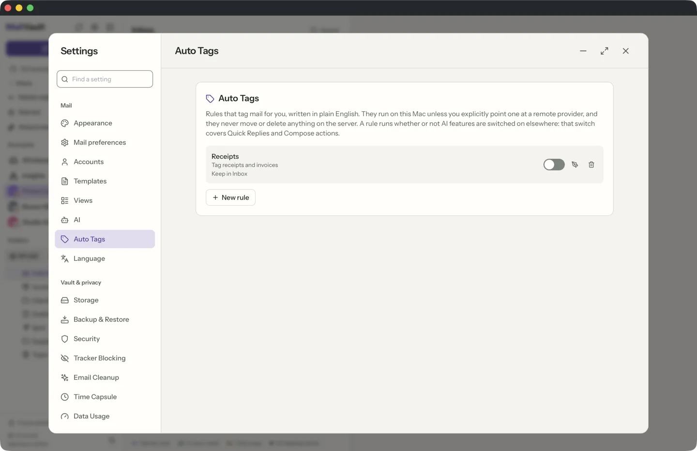
</picture>
<picture>
  <source media="(prefers-color-scheme: dark)" srcset="website/screenshots/custom-fields-1440.webp">
  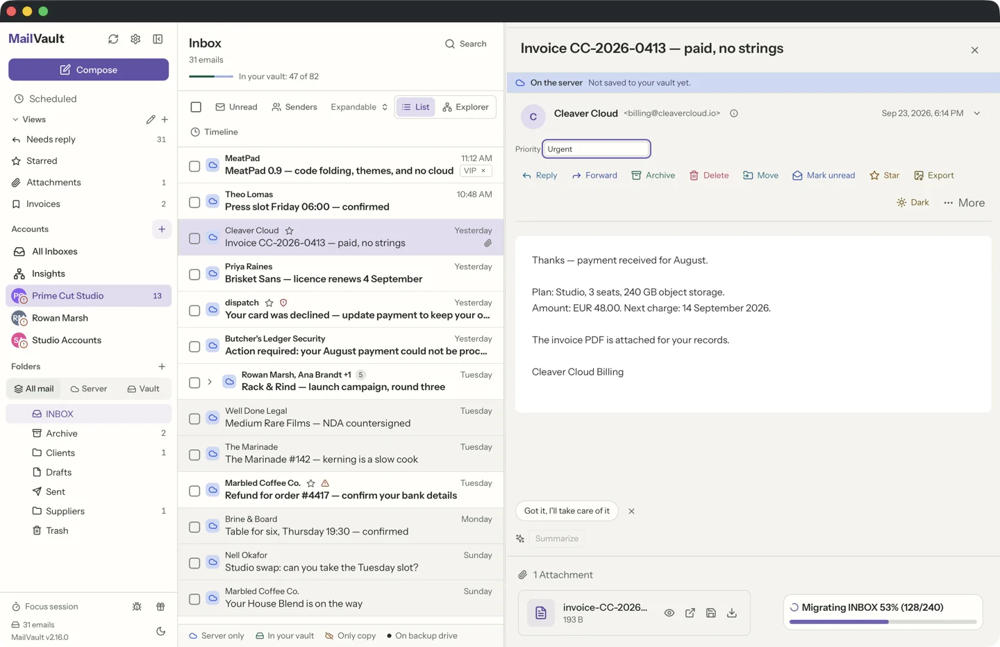
</picture>
</p>

- **Auto Tags** - rules, written in plain English, that tag matching mail as it arrives. They run on your computer unless you point them at a remote provider, and never move or delete anything on the server.
- **Saved views and custom fields** - filters that behave like inboxes, and your own fields, such as a priority, on any message.
- **AI writing help** - draft, shorten, change tone, or summarise a thread with a model that runs on your computer, or one you choose.
- **Layouts and themes** - three- or two-column, resizable panes, light and dark, customisable keyboard shortcuts.

### Bulk operations

<picture>
  <source media="(prefers-color-scheme: dark)" srcset="website/screenshots/selection-dialog-1440.webp">
  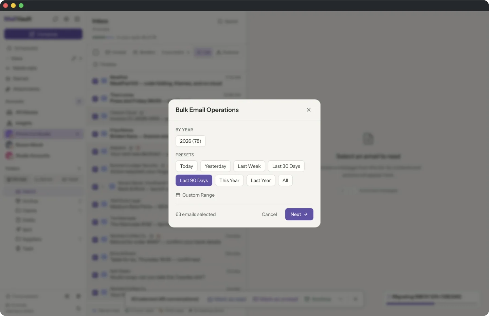
</picture>

Pick a year or a custom range, then archive, delete, or archive-and-delete thousands of messages in one pass, with a live progress bar, a cancel button, and crash-safe recovery if the machine gives up halfway.

### Security

<picture>
  <source media="(prefers-color-scheme: dark)" srcset="website/screenshots/link-safety-modal-1440.webp">
  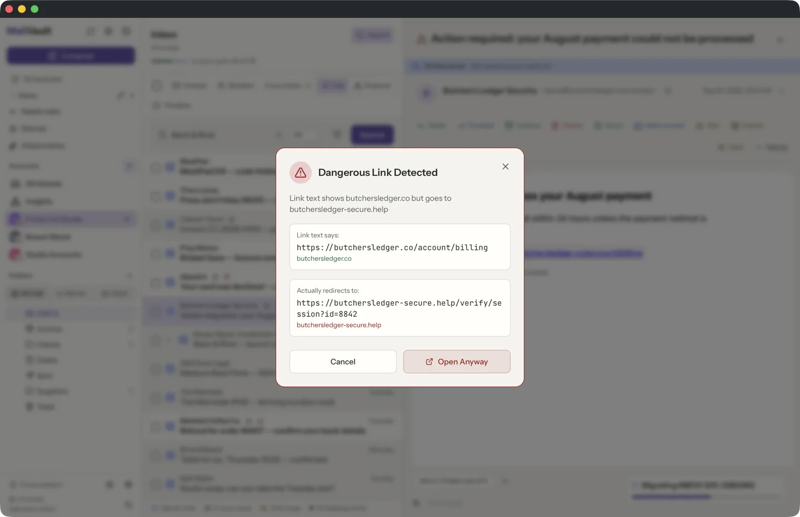
</picture>

- **Link safety** - a warning when a link's text is not where the link goes, with both URLs shown side by side before anything opens.
- **Sender checks** - SPF, DKIM and DMARC badges, display-name impersonation warnings, and From/Reply-To mismatch alerts.
- **Tracker blocking** *(Premium)* - the hidden pixels that report when you opened a message are found on every mail, named on the row, and stripped out of the HTML before it renders. Detection is free; removal comes with a subscription.
- **Credentials in the OS store** - macOS Keychain, Windows Credential Manager, Linux Secret Service. Never in a config file.
- **Sandboxed on macOS**, no cloud service, no tracking, no telemetry.

### Multi-account

<picture>
  <source media="(prefers-color-scheme: dark)" srcset="website/screenshots/unified-inbox-1440.webp">
  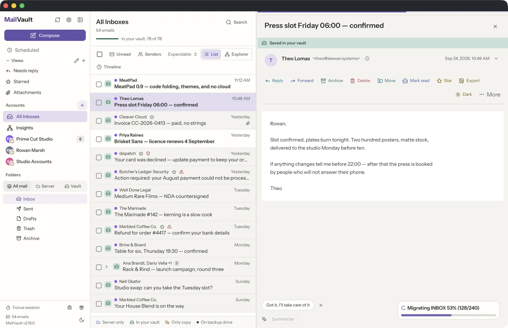
</picture>

Unlimited accounts, each with its own display name and colour, all mergeable into one unified inbox. Switching is instant (state is cached per account), and each account remembers the folder you left it in. Sender insights show your exchange history with a contact.

### Built for the long run

| | |
|---|---|
| Binary | ~8 MB (Rust + Tauri, not Electron) |
| Memory | ~80 MB idle |
| Startup | under a second |
| Search | SQLite FTS5, offline: 50,000 messages searched in under 15 ms in our test |
| Sync | CONDSTORE delta sync: zero IMAP calls when nothing changed |
| Bandwidth | COMPRESS=DEFLATE, 70–80% less on the wire |
| Lists | virtual scrolling, comfortable past 17,000 messages |

A background helper keeps mail syncing with the window closed, and the app updates itself with an in-app changelog.

### Premium

<p>
<picture>
  <source media="(prefers-color-scheme: dark)" srcset="website/screenshots/premium-scheduled-send-1440.webp">
  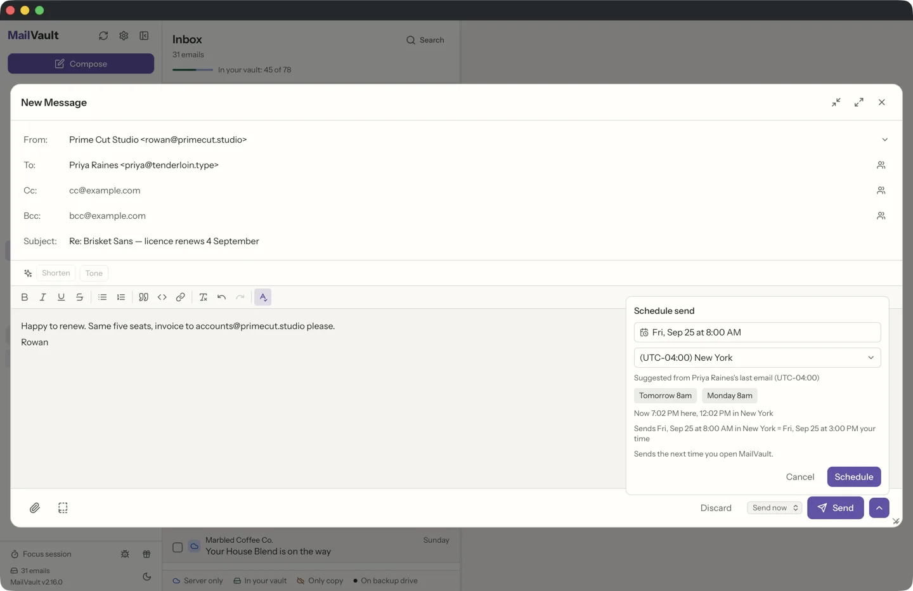
</picture>
<picture>
  <source media="(prefers-color-scheme: dark)" srcset="website/screenshots/premium-time-capsule-1440.webp">
  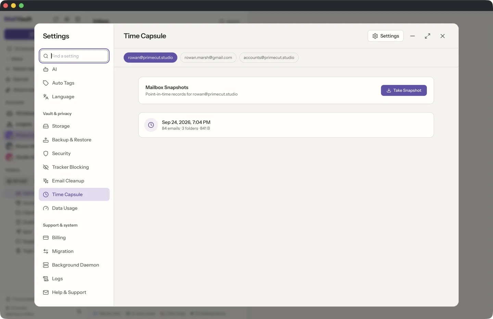
</picture>
</p>

The client is free forever: reading, composing, search, threading, Explorer, Insights, Auto Tags, and unlimited manual archiving. Premium adds the parts that need a scheduler or a server: automatic backups with health verification, cross-account migration, a guided server change with DNS health checks, cleanup rules driven by a local Naive Bayes classifier, attachment search, and Time Capsule snapshots of a mailbox as it was on any past date. Focus sessions, a timer that covers the window and holds notifications for the minutes you choose, are Premium too. So is Scheduled Send: an email goes out at the exact date and time you pick, in any time zone, with the recipient's zone suggested from their last email; delaying a send by up to five minutes stays free. So is Portable MailVault: a copy on a USB stick or external drive that runs on any computer with your mail and accounts on the drive, locked with a password (Windows for now). Pricing is on [mailvaultapp.com/pricing](https://mailvaultapp.com/pricing.html).

## Building

```sh
npm install
npm run tauri dev
```

Release build:

```sh
npm run tauri build
```

The Rust core lives in [`src-core/`](src-core/), the Tauri shell in [`src-tauri/`](src-tauri/), the background sync helper in [`src-daemon/`](src-daemon/), and the React front end in [`src/`](src/). Tests:

```sh
npx vitest run
npm run test:e2e
```

The E2E suite drives the real app against a scripted mock IMAP and SMTP server ([`src-mock-imap/`](src-mock-imap/)): no credentials, no network, no chance of touching a real mailbox, and a send that can either succeed or be refused on demand. Packaging, signing and notarisation are documented in [BUILDING.md](BUILDING.md).

The browser demo and the screenshot pipeline are documented in [BUILDING.md](BUILDING.md#browser-demo).

## Acknowledgements

MailVault stands on the work of these projects and their contributors: [Tauri](https://tauri.app/), [React](https://react.dev/), [Zustand](https://github.com/pmndrs/zustand), [TipTap](https://tiptap.dev/), [SQLite](https://sqlite.org/) through [rusqlite](https://github.com/rusqlite/rusqlite), [async-imap](https://github.com/chatmail/async-imap), [mailparse](https://github.com/staktrace/mailparse) and [lettre](https://github.com/lettre/lettre).

---

<p align="center">Made by <a href="https://graphicmeat.com">Graphic Meat</a></p>
